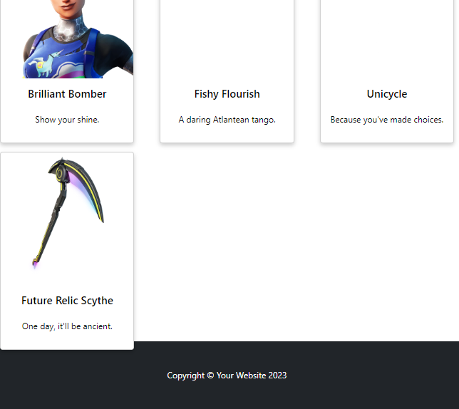

<h1>Shopping Cart Application:</h1>
The Shopping Cart Application is an educational project that was built with the intention of learning how to use components in React, manage state, use CRUD operations, and display the results of these operations to the user in the form of an e-commerce page (based off of a Fortnite api for items on the Fortnite shop - inspiration for this api came from: https://www.youtube.com/watch?v=Law7wfdg_ls). My goal for this application was to create components that were easy to understand while not being redundant. Additionally, my goal was to manage the state in a way that reduced confusion and made CRUD operations easy to follow throughout the components. All data is saved to local storage when the user clicks checkout.

<h3> What I Learned/What I Would Do Differently:</h3>
My primary learning goals for this project were basic React syntax and building components. Additionally, I learned how to use state to store and manage data that is used in a web application, as well as how to pass it between different pages on an application.

There are three main changes that I would make to my approach of the project if I were to redo the application.

1. All the component files were simply saved to the src directory rather than creating a specific directory to hold all component files. Creating this additional directory would help organize the files in my project in a way to make them more readible to another user. Additionally, directories for styles and images should be cleaned.
2. I built the projct without using a global state, resulting in similar props being passed to nearly every component. For an application like this in the future, I would implement a State Management Library (ex: Redux) and use global state to improve the readability of the logic within the application.
3. I learned from this application that making the application visually appealing is not only more fun for myself, but also significantly contributes to the user experience. During the beginning of this project, I was primarily focused on functionality, not visualization. On future projects, I plan to dedicate specific time to developing an aesthetic plan as well as a functionality-based plan.

<h3>Credits:</h3>
This project was inspired as a resonse to the Project: Shopping Cart lesson of the JavaScript Course on the Odin Project. Inspiration for the design of the Home Page was from  https://startbootstrap.com/previews/full-width-pics. Inspiration for how to set up rows of cards was from https://mdbootstrap.com/docs/standard/extended/card-columns/. Inspiration for design aspects of the Cart page were from https://mdbootstrap.com/docs/standard/extended/shopping-carts/.
Create-react-app was used for initial setup of the project.

<h3>Technologies Used:</h3>

1. JavaScript
2. React
3. Bootstrap

<h3>Build Status:</h3>
This application is fully functional with the exception of some images do not render on the shop page. It is not finished in terms of aesthetic design.
 UPDATE: Between 1/28/23 and 2/28/23 there was an update to the api used in this application. On 1/28/23 the application functioned properly but on 2/28/23 any fetch calls to the api by item id return a 404 error. Upon checking the api calls on the Postman provided in the api docs (link below), it appearas that there is an error in GET requests for specific items, as it always returns a 404 error. As such, the way that the itemDetail page renders information needed to be changed and now uses state rather than an api call. This has had the result of reducing loading time for each page as there are fewer api calls. However, when the user cart is saved to local storage and the application reloaded, the prices of each item saved to local storage may not match the newly generated prices of the items (as prices are randomized upon initial loading). 
 Postman for the api: https://web.postman.co/workspace/My-Workspace~caa80031-7b87-4a08-8816-edad735f17a8/request/26108438-8160dda3-0997-45a3-8970-4dc93375574f
Api docs: https://docs.fortniteapi.com/ 

<h3>Installation:</h3>

1. Clone repo from GitHub
2. In terminal, run the command: npm install
3. In terminal, run the command: npm start
4. Go to localhost:3000 in a web browser

<h3>Api Reference:</h3>
This application uses an Api which holds upcoming data for the items in the Fortnite shop. The api can be found at https://fortnite-api.theapinetwork.com/upcoming/get

<h3>How the Application Works:</h3>
NOTE: Images not all needed images are attached as the api call problem has not yet been fixed.

 Start by entering the home page. From here, will see a welcome page with sample text. The navbar at the top allows for the choices of entering the shop page or going to the cart. 

By clicking on the shop button in the navbar, cards of 10 available items will display on the screen. Each card can be clicked on to reveal more specific details (price, etc) and add it to the cart.

If the cart icon is clicked, the user is brought to a cart screen displaying all items currently in the cart, their price, the option to update the number of items, and the current running total. There is then a checkout button available to save the cart to local storage.
NOTE: the images do not display in this picture of the cart as the picture was taken after the api changed, so these items are no longer available.

